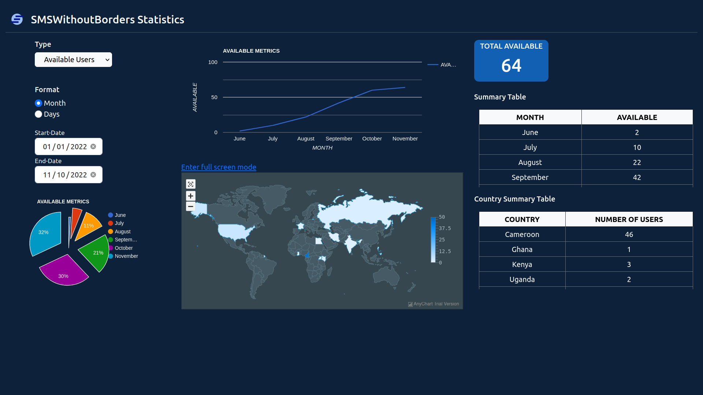

# SMSWithoutBorders-Telemetry-Front-End

This is a system for SMS Without Borders visual data analysis. ### [See Live](https://smswithoutborders.com:8080/)

## Tools
1. [Google Charts](https://developers.google.com/chart)
2. [Any Chart Map](https://www.anychart.com/)

## Licensing 
This project is licensed under the [GNU General Public License v3.0](LICENSE).

